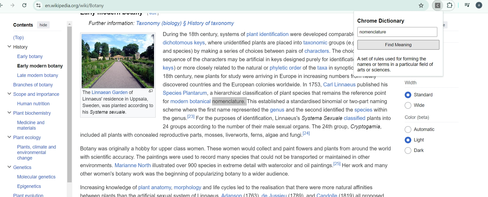
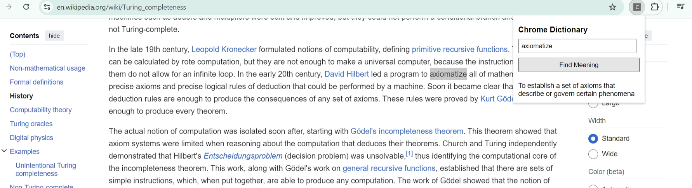
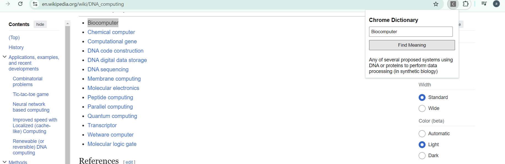

# ✨🔍🧠Chrome Dictionary - A Chrome Extension🧠🔍✨

A Chrome extension that lets you find the meaning of any word you do not know instantly while browsing. Without needing to open a new tab and search for the meaning or definition of word, just copy and paste or enter a word in the popup, and get its definition!

## 🏠Demo screenshots



##



##



## 🛠️ Tech Stack

- ☕ JavaScript
- 🌐 HTML
- 🎨 CSS

## 🚀 Features

- **Instant Definitions:** Find the meaning of any word quickly.
- **No API Key Required:** Uses the Free Dictionary API.
- **User-Friendly Interface:** Simple and intuitive design.

## 📦 Installation

1. **Clone or Download the Repository:**

   ```bash
   git clone https://github.com/amol1211/Chrome Dictionary.git
   ```

2. **Open Chrome Extensions Page:**

   Go to [chrome://extensions/](chrome://extensions/) in your Chrome browser.

3. **Enable Developer Mode:**

   Toggle the "Developer mode" switch in the top-right corner.

4. **Load Unpacked Extension:**

   Click "Load unpacked" and select the project directory.

## 💻 Code Overview

### `manifest.json`

Configures the extension's metadata and permissions.

```json
{
  "manifest_version": 3,
  "name": "Chrome Dictionary",
  "version": "1.0",
  "description": "Find the meaning of words quickly without needing to switch or open a new tab and search for meaning/definition of word.",
  "permissions": ["storage"],
  "background": {
    "service_worker": "background.js"
  },
  "action": {
    "default_popup": "popup.html"
  }
}
```

## ⚠️ Important Note

This extension doesn't require any background functionality, hence you don't need to include the background field in your manifest.json file(I added it because it's a standard practice/convention). The background service worker is only necessary if you have tasks or events that need to be handled independently of the popup or content scripts.
